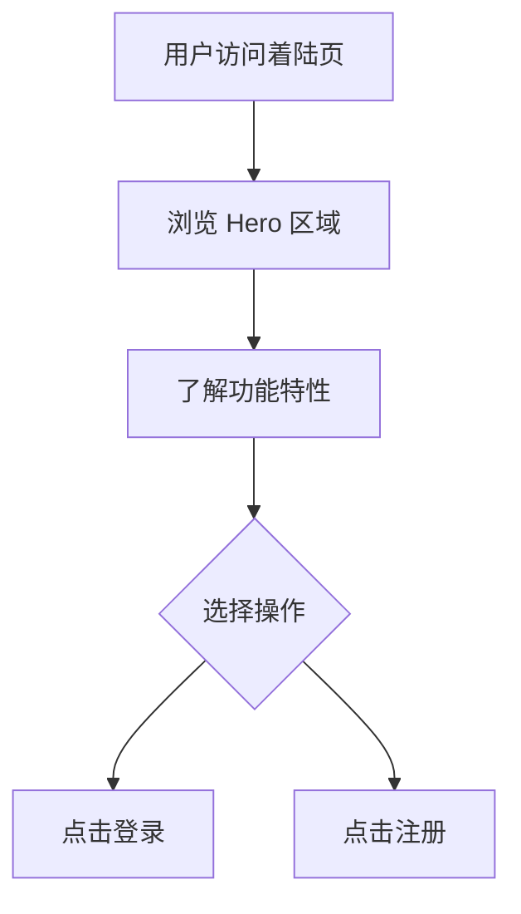

## 1. 产品概述

图小策｜AI生图工作台 —— 一款 AI 聊天式规划生图平台的着陆页。用户通过上传图片、AI 理解、聊天规划、批量出图，覆盖电商/生活照/创意生图场景。

- 目标用户：电商从业者、内容创作者、设计师等需要批量 AI 生图的用户
- 核心价值：用聊天方式让 AI 理解需求，精准规划并批量生成图片

## 2. 核心功能

### 2.1 用户角色

| 角色 | 注册方式 | 核心权限 |
|------|----------|----------|
| 普通用户 | 邀请码注册 | 浏览着陆页、注册/登录进入工作台 |

### 2.2 功能模块

1. **着陆页（首页）**：品牌展示、核心卖点介绍、登录/注册入口

### 2.3 页面详情

| 页面名称 | 模块名称 | 功能描述 |
|----------|----------|----------|
| 着陆页 | 顶部导航栏 | Logo + 品牌名展示 |
| 着陆页 | Hero 区域 | 主标题、副标题、登录/注册按钮、浮动功能标签 |
| 着陆页 | 功能特性网格 | 6 个功能卡片：上传图片AI理解、聊天式整理需求、规则模板控制一致性、多窗口工作流、批量出图与历史回看、个人工作空间 |

## 3. 核心流程

用户访问着陆页 → 了解产品功能 → 点击"登录后进入工作台"或"注册新账号"

## 4. 用户界面设计

### 4.1 设计风格

- 主色调：深色背景（近黑 #0f0f17），紫色/靛蓝强调色（#818cf8），青色辅助（#38bdf8）
- 按钮风格：圆角胶囊按钮，主按钮渐变背景，次按钮边框样式
- 字体：Inter 字体族，标题粗体 640，正文常规
- 布局风格：顶部导航 + 居中内容区，卡片式功能展示
- 图标风格：线性描边 SVG 图标（lucide 风格），1.8px 描边

### 4.2 页面设计概览

| 页面名称 | 模块名称 | UI 元素 |
|----------|----------|---------|
| 着陆页 | 顶部导航 | 深色背景、Logo 图片 + 品牌文字、左对齐 |
| 着陆页 | Hero 区域 | 渐变背景卡片、大标题 + 副标题、双按钮、右侧浮动标签 |
| 着陆页 | 功能网格 | 2-3 列响应式网格、6 个功能卡片、图标 + 标题 + 描述 |

### 4.3 响应式

- 桌面优先设计，1200px 最大宽度
- ≤1200px：功能网格变为 2 列
- ≤800px：单列布局，Hero 区域纵向排列
- ≤480px：紧凑间距，缩小字号

### 4.4 3D 场景指导

不适用
