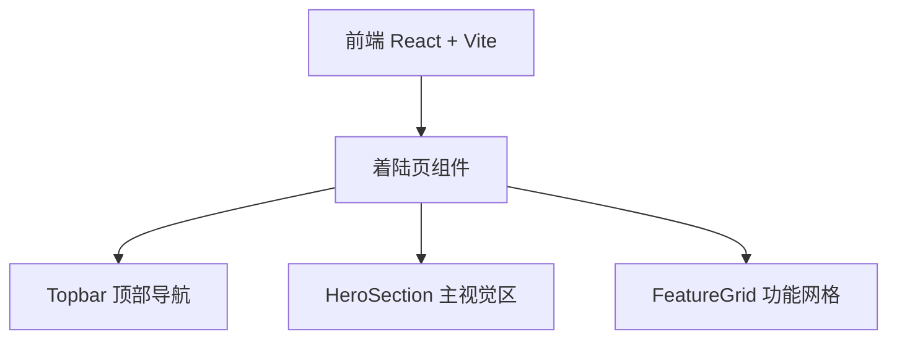

## 1. 架构设计

纯前端项目，无后端依赖。

## 2. 技术说明

- 前端：React@18 + Tailwind CSS@3 + Vite
- 初始化工具：vite-init
- 后端：无
- 数据库：无

## 3. 路由定义

| 路由 | 用途 |
|------|------|
| / | 着陆页，展示产品介绍和登录/注册入口 |

## 4. API 定义

无后端 API，纯静态着陆页。

## 5. 服务器架构图

不适用

## 6. 数据模型

不适用
